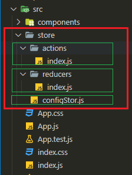

<!-- @format -->

# setredux

A single command to setup **redux** store files and connect it to React

## Installation

You can install the locally:

```shell
npm install --save-dev setredux
```

Or install it globally (**recommended**) so you can use it on other projects without the need to install it again.

```shell
npm install -g setredux
```

## Usage

Once you installed the package as mentioned before you can use it in your project.

So on the root directory of your React App try run the following command:

```
setredux init
```

This command will output the following files in this certain structure.

## Output

The command outputs store in the following structure:



## Files Content
Every file will have a snippet as boilerplate.


`configStore.js`

```js
import { createStore } from 'redux';
import rootReducer from './reducers';

export default createStore(rootReducer);
```

`actions/index.js`

```js
// 'counter.actions' may hold multiple actions creators such as 'increment', 'decrement', etc.
// export * from './counter.actions';
```

`reducers/index.js`

```js
import { combineReducers } from 'redux';
// import counterReducers from 'counter.reducer';

export default combineReducers({
  // counter: counterReducer
});
```

## Options

`--connect`

If you want to let the command connect your **redux store** automatically to your React App, try to use `--connect` option:

```shell
setredux init --connect
```

Then it will overwrite the existing content of `index.js` with this new content:

```js
import React from 'react';
import ReactDOM from 'react-dom';
import { Provider } from 'react-redux';

import './index.css';
import * as serviceWorker from './serviceWorker';
import storeConfig from './store/storeConfig';
import App from './App';

const store = storeConfig();
const app = (
  <Provider store={store}>
    <App />
  </Provider>
);

ReactDOM.render(app, document.getElementById('root'));

// If you want your app to work offline and load faster, you can change
// unregister() to register() below. Note this comes with some pitfalls.
// Learn more about service workers: https://bit.ly/CRA-PWA

serviceWorker.unregister();
```

**_Just an additional option to the command_** 🙂

`--thunk`

You can use this option to add `redux-thunk` setup to your project automatically.

So if you used it ,`configStore.js` file will have the following content:
``` js
import thunk from 'redux-thunk';
import createDebounce from 'redux-debounced';
import { createStore, applyMiddleware, compose } from 'redux';

import rootReducer from './reducers/index.js';

//*  create middleware
const middleware = [thunk, createDebounce()];

//* Debug & Dev Tools
const composeEnhancers = window.__REDUX_DEVTOOLS_EXTENSION_COMPOSE__ || compose;

//* Create store
const store = createStore(rootReducer, {}, composeEnhancers(applyMiddleware(...middleware)));

export { store };
```

`--version` or `-v`

If you want to know the version of the package, run:
``` shell
setredux --version
```
Or you can just use `-v`:
```
setredux -v
```
## The Final Command

You can use the following command to setup everything to you automatically:

```
setredux init --connect --thunk
```